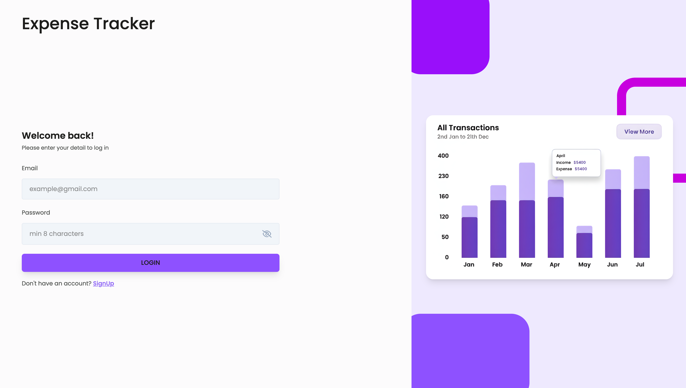
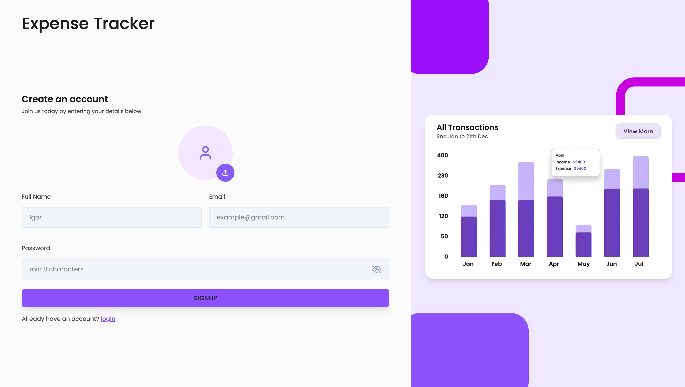
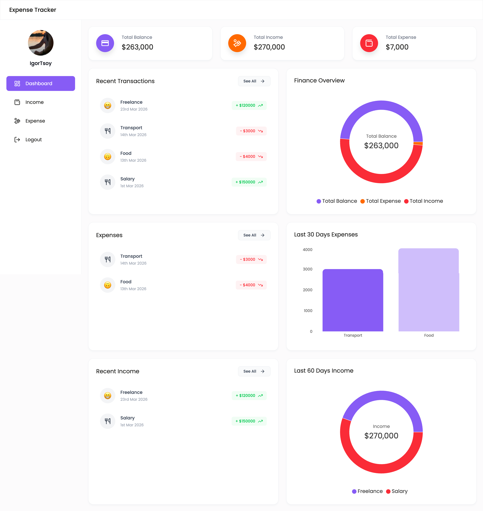
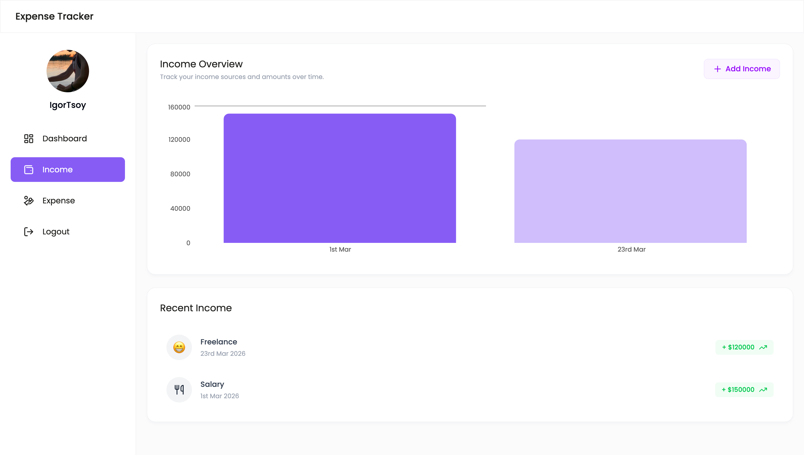
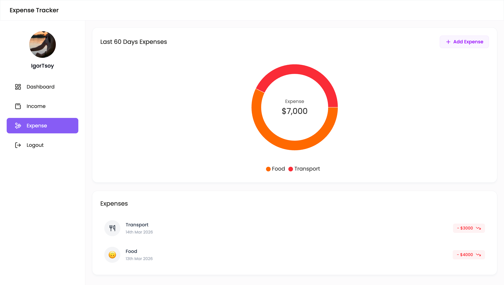

# Expense Tracker web application

## Описание
Современное fullstack-приложение для учета личных финансов с авторизацией, дашбордом, добавлением доходов и расходов, графиками аналитики и хранением данных на сервере.

Проект построен на `MERN`-подходе:
- фронтенд на `React + TypeScript + Vite`
- глобальное состояние на `Redux Toolkit + react-redux`
- бэкенд на `Node.js + Express`
- база данных на `MongoDB`

## Скриншоты приложения

### Десктопная версия

#### Login


#### Sign Up


#### Dashboard


#### Income


#### Expense


## Возможности
- Регистрация и авторизация пользователя
- Получение данных текущего пользователя
- Просмотр общего финансового дашборда
- Отображение общей суммы баланса, доходов и расходов
- Добавление доходов
- Удаление доходов
- Добавление расходов
- Удаление расходов
- Отображение доходов и расходов в виде графиков
- Глобальный loader во время запросов к серверу
- Глобальная модалка ошибок при неуспешных запросах
- Страница `404` с возвратом в корень дерева путей
- Хранилище данных на `Redux Toolkit` со слайсами пользователя, настроек, доходов, расходов и дашборда

## Возможные добавления
- Редактирование доходов и расходов
- Фильтрация транзакций по периоду
- Поиск по категориям и источникам
- Экспорт отчетов в дополнительные форматы
- Подтверждение удаления через отдельную модалку
- Адаптация под темную тему
- Разделение бандла на чанки для уменьшения размера фронтенда

## Установка и запуск

### 1. Клонируйте репозиторий

```bash
git clone https://github.com/TsoyIgorDev/expense-tracker.git
```

### 2. Перейдите в папку проекта

```bash
cd expense-tracker
```

### 3. Установите зависимости для frontend

```bash
cd frontend/expense-tracker
npm install
```

### 4. Установите зависимости для backend

```bash
cd ../../backend
npm install
```

### 5. Запустите backend

```bash
npm run dev
```

### 6. Запустите frontend

Откройте новый терминал:

```bash
cd frontend/expense-tracker
npm run dev
```

### 7. Сборка frontend

```bash
cd frontend/expense-tracker
npm run build
```

Приложение фронтенда будет доступно по адресу: `http://localhost:5173`

## Технологии

### Frontend
- `Vite` - современный сборщик проекта
- `React` - библиотека для построения пользовательских интерфейсов
- `TypeScript` - типизация приложения
- `Redux Toolkit` - управление глобальным состоянием
- `react-redux` - интеграция Redux с React
- `React Router` - маршрутизация
- `Recharts` - построение графиков
- `Tailwind CSS` - стилизация интерфейса
- `Axios` - HTTP-запросы

### Backend
- `Node.js` - серверная среда выполнения
- `Express` - backend framework
- `MongoDB` / `Mongoose` - хранение и работа с данными
- `JWT` - авторизация
- `Multer` - загрузка изображений
- `xlsx` - экспорт данных в Excel

## Структура проекта

```text
expense-tracker/
├── backend/                    # Серверная часть приложения
│   ├── controllers/            # Контроллеры API
│   ├── middleware/             # Middleware
│   ├── models/                 # Mongoose модели
│   ├── routes/                 # Роуты API
│   ├── uploads/                # Загруженные изображения
│   ├── package.json            # Зависимости backend
│   └── server.js               # Точка входа backend
├── frontend/
│   └── expense-tracker/
│       ├── public/             # Публичные статические файлы
│       ├── src/
│       │   ├── assets/         # Изображения и статические ресурсы
│       │   ├── components/     # UI-компоненты
│       │   ├── hooks/          # Пользовательские hooks
│       │   ├── pages/          # Страницы приложения
│       │   ├── store/          # Redux store и slices
│       │   ├── utils/          # Утилиты и API helpers
│       │   ├── App.tsx         # Основной компонент приложения
│       │   └── main.tsx        # Точка входа frontend
│       ├── index.html          # Главный HTML файл
│       ├── package.json        # Зависимости frontend
│       └── vite.config.ts      # Конфигурация Vite
├── screenshots/                # Скриншоты для документации
│   ├── dashboard.png
│   ├── expense.png
│   ├── income.png
│   ├── login.png
│   └── signup.png
└── README.md
```

## Примечание
Для корректной работы проекта нужен настроенный `.env` на стороне backend и запущенная MongoDB база данных.
